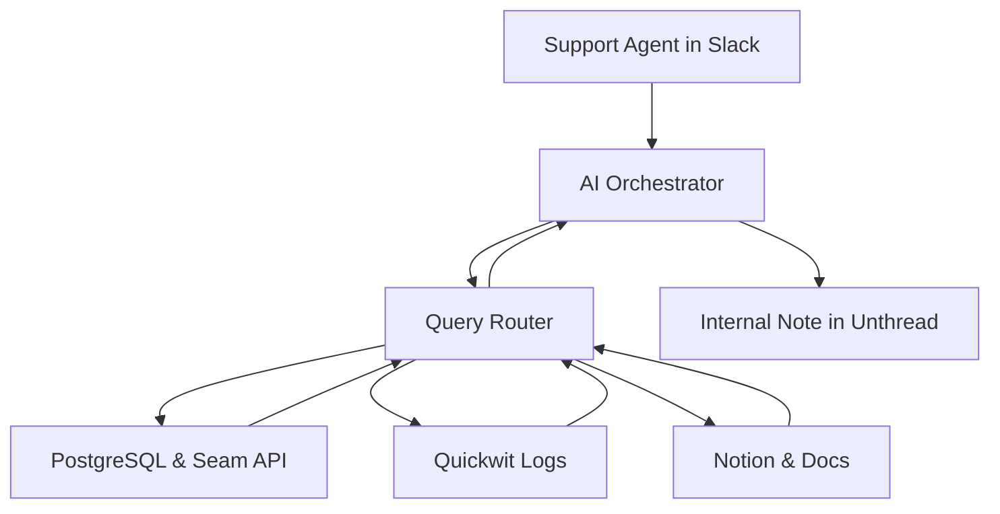

# Customer Support Assistant: Product & Technical Specification

## Executive Summary

### Problem Statement
Seam's customer support team currently spends significant time (30% of cases) manually navigating through admin dashboards, job logs, and various data sources to debug customer issues. The current process involves:
- Multiple clicks through hard-to-understand admin interfaces
- Manual log analysis with poor search capabilities (rated 2/5 experience)
- Time-consuming triangulation of timestamps across job logs, action attempts, and errors
- Inability to link to specific logs, causing duplicated engineering effort
- Manual timeline reconstruction for issues reported days/weeks after occurrence

> Note: Real customer conversations from the last 3 weeks can be found in [customer-conversations-3-weeks.txt](customer-conversations-3-weeks.txt). These examples inform the use cases and requirements in this PRD.

### Solution Vision
An AI-powered customer support assistant that can instantly gather, analyze, and present relevant debugging information from multiple data sources, reducing manual effort and improving response times from hours to minutes.

### Success Metrics
- **Efficiency**: 2x improvement in support agent effectiveness
- **Time Reduction**: Reduce log analysis time from 30% to <10% of support cases
- **Response Time**: Decrease average case resolution time by 50%

---

## Product Requirements

### Primary User Personas

**1. Customer Support Agent (Primary)**
- Handles 10-20 support cases daily via Slack/Unthread
- Needs quick access to device status, error logs, and timeline reconstruction
- Currently frustrated with admin dashboard navigation

**2. Engineering Team (Secondary)**
- Escalation point for complex technical issues
- Needs detailed technical context without duplicating investigation work

### Core User Stories

**MVP User Stories:**

1. **As a support agent**, I want to ask "What's wrong with device X?" and get a complete timeline of recent events, errors, and current status so I can quickly diagnose device and access code issues
2. **As a support agent**, I want to ask "Is there a known issue with provider Y?" and get information about outages, beta status, or common problems so I can provide accurate status updates
3. **As a support agent**, I want to ask API and documentation questions like "How do I use endpoint Z?" and get relevant code examples and explanations so I can help developers quickly
4. **As a support agent**, I want to investigate account issues like device conflicts or usage limits and get clear explanations of the problem and resolution steps

**Future Enhancement Stories:**
5. **As a support agent**, I want to ask simple questions like "Is device brand X supported?" and get immediate answers so I can respond to basic inquiries without manual lookup
6. **As a support agent**, I want to receive proactive alerts when a workspace shows unusual error patterns or device management activity
7. **As a support agent**, I want to generate customer-ready explanations and next steps based on technical findings
8. **As a support agent**, I want to create internal escalation summaries with all relevant context for engineering

### Key Use Cases from Customer Examples

> Note: The following use cases are derived from the analysis of real customer conversations documented in `conversation-analysis.md`. They represent the most frequent and critical support scenarios.

**Use Case 1: Device & Access Code Investigation**
- **Scenario**: A customer reports that an access code is not working or a device appears offline. The support agent needs to quickly diagnose the root cause by investigating the device's history, recent action attempts, and any related errors. (Ref: Conv. 4, 9, 11, 15, 41, 67, 91)
- **Required Analysis**:
  - Fetch device status, history, and capabilities from PostgreSQL or the Seam API.
  - Query `action_attempts` for success/failure logs related to the device/code.
  - Search Quickwit logs for error messages correlated with the device ID and timeframe.
  - Correlate events across different systems (Seam, Provider) to build a complete timeline.
- **Output**: A summarized timeline of events, a likely root cause (e.g., "Provider API returned 500 error," "Device has been offline for 24 hours"), and suggested next steps for the customer or agent.

**Use Case 2: Provider-Specific Issue Triage**
- **Scenario**: A customer experiences an issue with all devices from a specific brand (e.g., Schlage, August), or an integration is not behaving as expected. The agent must determine if this is a known provider outage, a beta integration issue, or a new problem. (Ref: Conv. 6, 15, 23, 29, 34, 60)
- **Required Analysis**:
  - Access a knowledge base (Notion) for known issues or ongoing incidents with that provider.
  - Check for recent spikes in errors for that provider across multiple workspaces.
  - Verify if the integration is marked as `beta` or has known limitations.
- **Output**: A summary of the provider's status, links to any relevant internal/public issue trackers, and a recommendation (e.g., "This is a known August outage we are monitoring," "This integration is in beta and may be unstable").

**Use Case 3: API & Developer Question Answering**
- **Scenario**: A developer asks a question about an API endpoint, is confused by the documentation, or is seeing unexpected behavior when using the Seam API. (Ref: Conv. 16, 20, 27, 51, 56, 82)
- **Required Analysis**:
  - Perform semantic search across `docs.seam.co` for relevant documentation pages and guides.
  - Provide correct code examples for the endpoint in question.
  - Explain the meaning of specific API error messages or why a field might be deprecated.
- **Output**: A direct answer to the developer's question, complete with links to documentation and correct code snippets.

---

## Technical Architecture

The architecture is designed to be simple and modular for the MVP, focusing on a core set of components to deliver the initial use cases. The workflow is centered around an AI Orchestrator that intelligently queries various data sources to build a complete picture for the support agent.



### Core Components

1.  **AI Orchestrator**: The "brain" of the assistant. It uses an LLM to understand the support agent's query, coordinate with the `Query Router`, and generate the final summary to be posted in Unthread.

2.  **Query Router & Context Builder**: This component is the data-fetching engine. It takes the parsed query from the Orchestrator, makes parallel calls to the necessary data sources, and aggregates the information into a unified context for the Orchestrator to use.

3.  **Data Sources**: For the MVP, the assistant will rely on three primary sources of information:
    *   **PostgreSQL & Seam API**: For real-time, structured data about devices, accounts, and action history.
    *   **Quickwit**: For deep-diving into unstructured logs to find specific error messages and reconstruct event timelines.
    *   **Notion & Public Docs**: For accessing our institutional knowledge, including provider-specific guides, known issues, and API documentation.

---

## User Experience & Interface Design

For the MVP, the primary interface will be a command-based workflow within Slack, integrated with Unthread. This allows support agents to trigger the assistant from an active customer conversation without leaving their primary workspace.

### Agent Workflow in Slack & Unthread

1.  **Triggering the Assistant**: From a customer conversation thread in Slack, the support agent will invoke the assistant using a specific command (e.g., mentioning `@support-assistant`).

    ```
    @support-assistant What's wrong with device 53037e09-c2a5-4f84-ad39-3f42893722d5?
    ```

2.  **Internal Analysis & Response**: The assistant will perform its analysis and post the findings as an **internal note** within the corresponding Unthread ticket. This ensures the information is visible to the support team only, allowing the agent to review the findings before communicating with the customer.

3.  **Internal Note Format**: The note posted by the assistant will contain a structured summary of its findings.

    ```
    🔍 **Device Analysis**: Nuki Pòsit 1 (53037e09-c2a5-4f84-ad39-3f42893722d5)

    ⚠️ **Issue Identified**: Access code setting failures
    📊 **Status**: Active issue since 2025-07-15

    📋 **Timeline**:
    • 14:41:11 - Create request sent to Nuki API (204 response)
    • 14:41:15 - List check shows no code created
    • 14:41:20 - Retry attempt (same result)
    • Similar delete request failures detected

    🔧 **Root Cause**: Nuki API connectivity issue
    📖 **Similar case**: https://developer.nuki.io/t/http-code-204-but-code-apparently-not-created/29886

    🎯 **Next Steps**:
    1. Verify device connectivity (last update: 14:41:11)
    2. Contact Nuki support with API logs
    3. Consider device restart/reconnection

    📎 **Logs**: [View detailed logs] | [Escalate to engineering]
    ```
---

## Security & Compliance Considerations

### Data Access Controls
- Role-based access control for different data sources
- Audit logging for all assistant queries and actions
- Data retention policies for conversation history
- Secure API key management and rotation

### Privacy & Compliance
- Customer data handling compliance (GDPR, CCPA)
- Internal access logging and monitoring
- Sensitive data masking in responses
- Integration with existing security frameworks

### Reliability & Monitoring
- Query performance monitoring and alerting
- Data source availability tracking
- Assistant response accuracy monitoring
- Fallback mechanisms for service degradation

---

## Technical Risks & Mitigation

### Risk 1: Data Source Latency
**Risk:** 10-20 second job log delays impact user experience
**Mitigation:** Implement aggressive caching, async processing, and progressive response loading

### Risk 2: Query Complexity
**Risk:** Complex multi-source queries may timeout or fail
**Mitigation:** Implement query optimization, parallel processing, and graceful degradation

### Risk 3: AI Accuracy
**Risk:** Incorrect analysis could mislead support agents
**Mitigation:** Confidence scoring, human review flags, and continuous accuracy monitoring

### Risk 4: Rate Limiting
**Risk:** API rate limits could block assistant functionality
**Mitigation:** Intelligent rate limiting, request queuing, and fallback data sources

---

## Next Steps

1. **Stakeholder Review**: Share this spec with engineering and support teams for feedback
2. **Technical Feasibility**: Validate data source access patterns and API capabilities
3. **Prototype Planning**: Define minimal viable prototype for initial validation
4. **Resource Allocation**: Determine team composition and timeline commitments
5. **Success Metrics**: Establish baseline measurements for current support workflows
